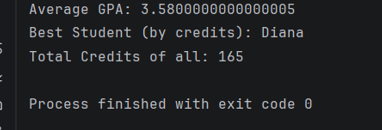

# Student Management System - Assignment 1

## ## A. Project Overview
This project is a simple Student Management System written in Java. It allows tracking student information such as names, IDs, GPAs, and credits. The main goal is to practice core OOP principles like encapsulation and composition.

## ## B. Class Descriptions
* **Student**: Handles individual student data including name, ID, GPA, and credits. It uses private fields and provides methods to update scores.
* **Course**: Manages a group of students using an array. It calculates the average GPA of the class and identifies the student with the highest credits.

## ## C. How to Run
1. Open the terminal in the project folder.
2. Compile the code:
   ```bash
   javac src/*.java
   java -cp src Main
## D. Screenshots
Below is the program output showing the statistics for the student array:



## E. Reflection
In this assignment, I learned how to use object-oriented programming principles like encapsulation. I implemented private fields and public getters/setters to ensure data security. The most challenging part was managing an array of objects and calculating statistics through loops.

   

